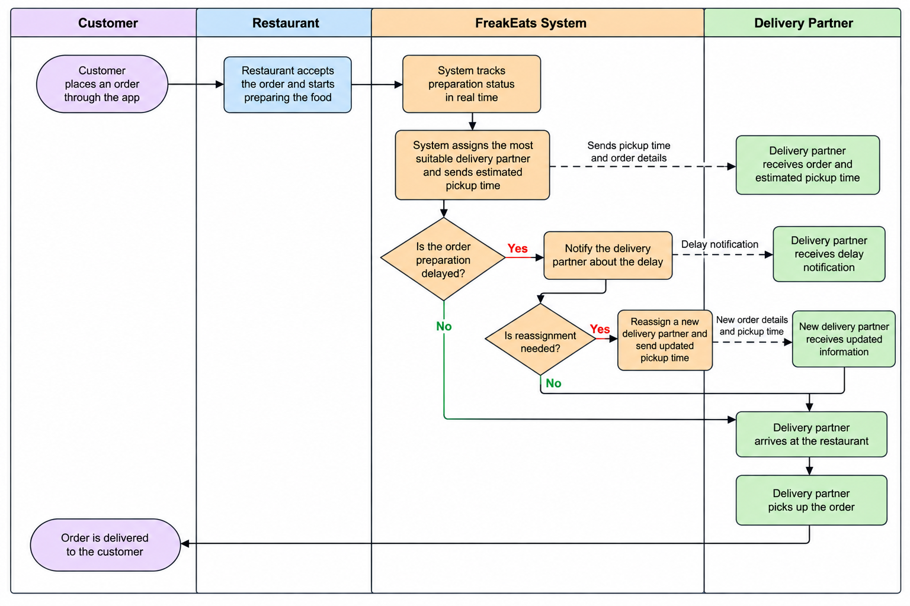

# FreakEats-Business-Process-Analysis

## Overview

This project demonstrates business process analysis and process
optimization for FreakEats, a fictitious online food delivery platform.

The purpose of the analysis was to understand the food delivery process,
identify key stakeholders and operational pain points, and design an
improved process flow.

## Stakeholders

- Customers
- Restaurant staff
- Delivery partners
- FreakEats support team

  ## AS-IS Process

The AS-IS model represents the current FreakEats food delivery
process before the proposed improvements.

## Identified Pain Points

### Customers
- Delivery delays
- Inaccurate estimated delivery times

### Restaurants
- Food preparation bottlenecks
- Communication issues with delivery partners

### Delivery Partners
- Extended waiting times when orders are not ready
- Limited parking near pickup locations

### FreakEats Support Team
- Managing customer complaints
- Resolving communication issues between stakeholders

## Proposed Improvements

### Real-Time Preparation Updates
Delivery partners receive information about the expected pickup time
based on the restaurant's current preparation status.

### Optimized Driver Assignment
A delivery partner is assigned and provided with an estimated pickup
time to improve coordination.

### Dynamic Driver Reassignment
If restaurant preparation is delayed, the delivery partner can be
reassigned to reduce unnecessary waiting time.

## Improved Process Flow

The improved process uses swimlanes to represent responsibilities across
the Customer, Restaurant, and Delivery Partner stakeholders.

The process also includes decision points and exception handling for
delivery-partner availability and restaurant preparation delays.

## Tools & Techniques

- Lucidchart
- Process Flow Modeling
- Swimlane Diagram
- Stakeholder Analysis
- AS-IS / TO-BE Analysis
- Process Optimization

## Skills Demonstrated

- Business Process Analysis
- Stakeholder Identification
- Pain Point Identification
- Process Modeling
- Requirements Thinking
- Solution Design
- Process Improvement
